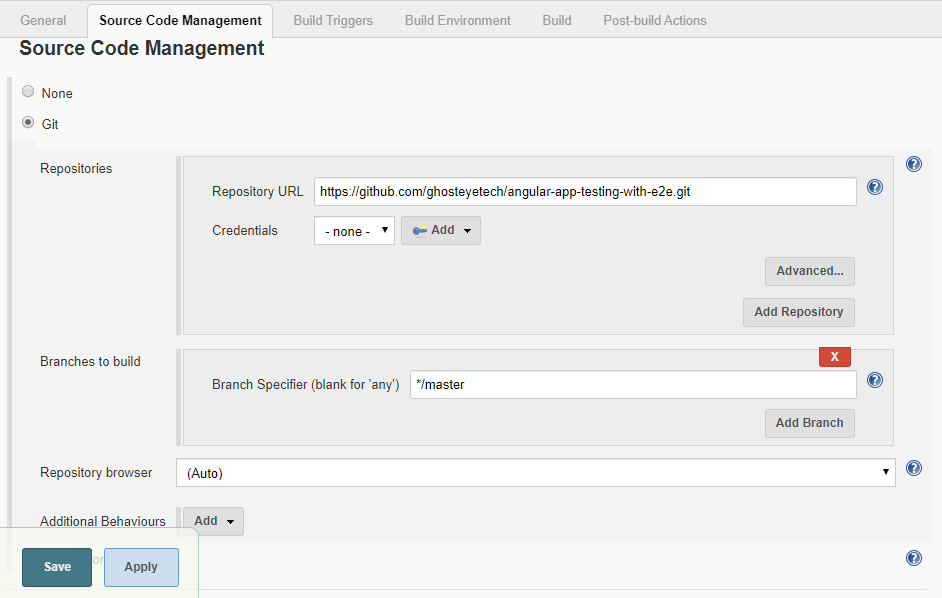
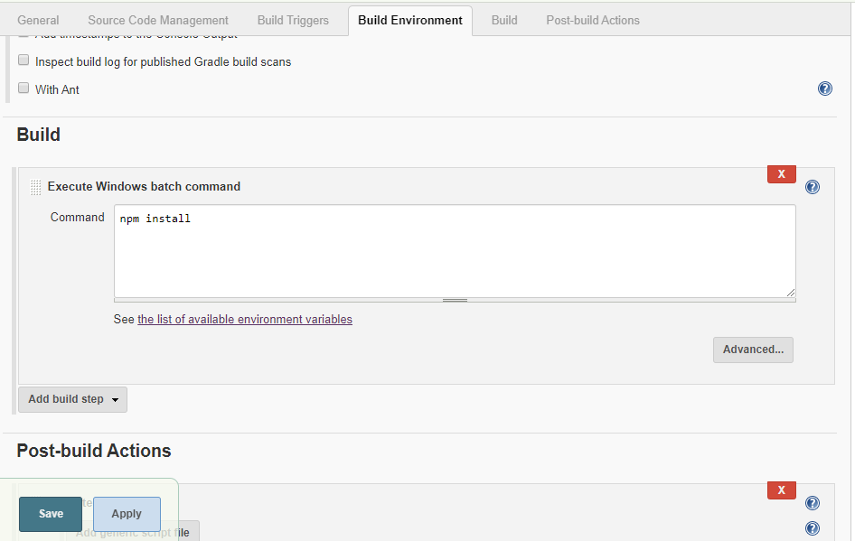

Original tutorial link: 
https://scotch.io/@charlieoduk/angular-end-to-end-testing507

# AngularAppTesting with e2e

## Running end-to-end tests

Run `ng e2e` to execute the end-to-end tests via [Protractor](http://www.protractortest.org/).

NOTE: GHOST

> In protractor.conf.js we can specify the order of the test case files in "config.specs" array.
> Right now has to make test case files manually by creating folders
> Good practice is maintain same file naming for test files in the e2e folder

## Implementation with jenkins

>JUnitReporter to get the test report to show up in Jenkins. For that add jasmine-reporters and the code below to the protractor.conf.js.
```
   $ npm i --save-dev jasmine-reporters
```
```
    const { JUnitXmlReporter } = require('jasmine-reporters');
    ...
    onPrepare() {
    ...
        const junitReporter = new JUnitXmlReporter({
        savePath: './e2e/test-results/E2E',
        consolidateAll: true//false // (false) -> will create seperate xml file for each test case file
        });
        jasmine.getEnv().addReporter(junitReporter);
    }

```

> Adding headless testing config for protractor.conf.js
```
    capabilities: {
    chromeOptions: {
        args: [ "--headless" ]
    },
    'browserName': 'chrome'
    },
```

>In order run post scripts( like npm run e2e) in jenkins has to install "PostBuildScript" plugin. For that go to jenkin plugin manager -> Available tab -> search for "PostBuildScript" and install.

    

>Set repository details in Jemkins "Source Management" section
    

>Adding Build config in “Build” section 
    


## Development server

Run `ng serve` for a dev server. Navigate to `http://localhost:4200/`. The app will automatically reload if you change any of the source files.

## Code scaffolding

Run `ng generate component component-name` to generate a new component. You can also use `ng generate directive|pipe|service|class|guard|interface|enum|module`.

## Build

Run `ng build` to build the project. The build artifacts will be stored in the `dist/` directory. Use the `--prod` flag for a production build.

## Running unit tests

Run `ng test` to execute the unit tests via [Karma](https://karma-runner.github.io).


